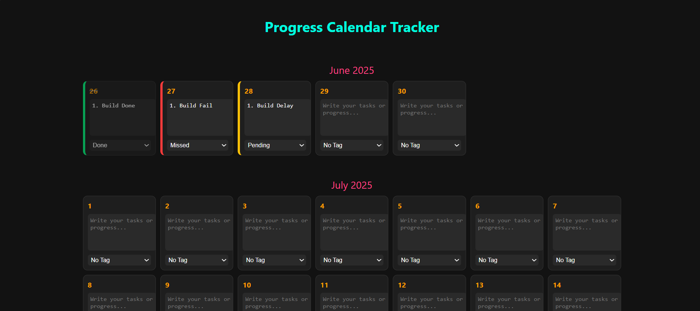

# 🗓️ Progress Calendar Tracker

A sleek, dark-themed personal productivity calendar that helps you track your day-to-day progress with visual feedback. Built to be offline, private, and super easy to use.

---

### ✨ Key Features

- ✅ **Click-to-strike** any day to mark it as done
- 🖊️ **Add notes or tags** to any date (like “Done”, “Pending”, “Missed”)
- 🔐 **Login system** to secure your personal view
- 🌑 **Dark mode UI** for a clean and eye-friendly look
- 🧠 **No internet needed** – works 100% offline
- 🔁 **Data stays saved** even after you close the tab

---

> Designed to help you stay consistent, motivated, and visually track how far you’ve come.

---
